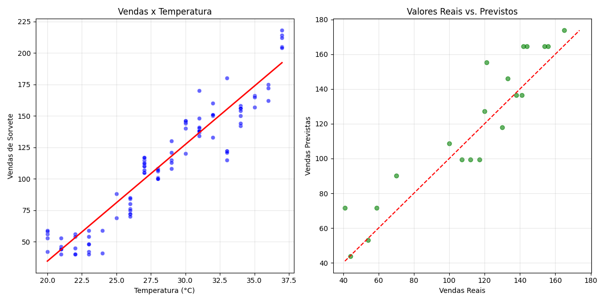
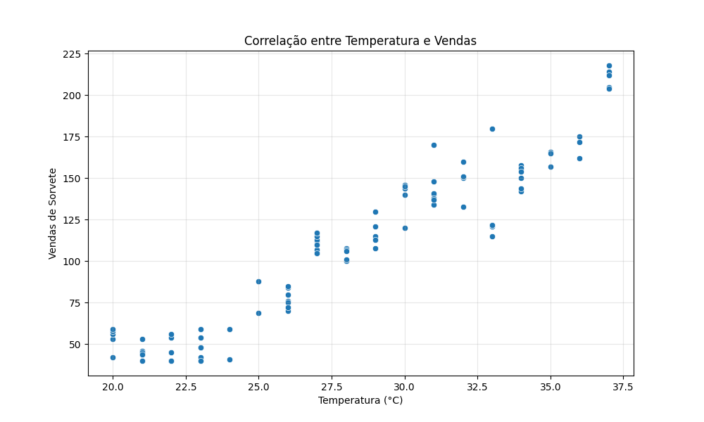

# 🍦 Gelato Mágico Gilson Silva - Sistema de Previsão de Vendas



## 📋 Sobre o Projeto

Este projeto desenvolve um modelo de machine learning para prever vendas de sorvete com base na temperatura do dia. Utilizando dados históricos da sorveteria "Gelato Mágico", o modelo ajuda a otimizar a produção diária, reduzindo desperdícios e maximizando lucros.

## 🎯 Objetivo

Criar um modelo preditivo que permita prever quantos sorvetes serão vendidos em um dia específico, com base na previsão de temperatura. Isso permite:

- Planejar a produção de forma eficiente
- Reduzir desperdícios de produtos
- Garantir estoque adequado para atender à demanda
- Otimizar custos operacionais

## 📊 Visão Geral dos Dados

Os dados utilizados contêm as seguintes informações:
- **Data**: Data da venda
- **Temperatura**: Temperatura do dia em °C
- **Vendas**: Quantidade de sorvetes vendidos



## 🤖 Modelo de Machine Learning

Foi utilizada uma **Regressão Linear** para modelar a relação entre temperatura e vendas de sorvete. Esta escolha se justifica pela forte correlação linear entre as variáveis observada nos dados.

### Métricas de Performance:

- **R²**: 0.93 (93% da variação nas vendas é explicada pela temperatura)
- **MAE**: 5.21 (erro médio absoluto de aproximadamente 5 sorvetes)
- **RMSE**: 6.75 (raiz do erro quadrático médio)

## 📈 Insights Obtidos

1. **Correlação Forte**: Existe uma correlação de aproximadamente 0.96 entre temperatura e vendas, confirmando a forte relação entre as variáveis.

2. **Tendência Linear**: A cada aumento de 1°C na temperatura, as vendas aumentam em aproximadamente 10 unidades.

3. **Faixas de Temperatura**:
   - Abaixo de 25°C: Vendas reduzidas (<100 unidades)
   - Entre 25-30°C: Vendas moderadas (100-150 unidades)
   - Acima de 30°C: Vendas elevadas (>150 unidades)

4. **Ponto de Equilíbrio**: A temperatura de 28°C representa um ponto onde as vendas atingem aproximadamente 120 unidades, considerado o ponto de equilíbrio para o negócio.

## 🛠️ Como Executar o Projeto

### Requisitos:

```bash
pip install -r requirements.txt
```

### Execução:

1. **Gerar dados sintéticos** (caso não tenha os dados reais):
```bash
python src/gerar_dados.py
```

2. **Executar o pipeline completo**:
```bash
python src/pipeline.py
```

3. **Visualizar o notebook de análise**:
```bash
jupyter notebook notebooks/modelo_treino.ipynb
```

4. **Visualizar os experimentos no MLflow**:
```bash
mlflow ui
```

## 📁 Estrutura do Projeto

```
MLVendasLab/
├── inputs/                 # Dados de entrada
│   └── base_vendas_sorvete.csv
├── notebooks/              # Notebooks Jupyter para análise
│   └── modelo_treino.ipynb
├── outputs/                # Resultados e visualizações
│   ├── correlacao.png
│   ├── distribuicao_dados.png
│   ├── resultados_modelo.png
│   └── previsoes_demonstracao.csv
├── src/                    # Código fonte
│   ├── gerar_dados.py      # Gera dados sintéticos
│   ├── pre_processamento.py # Funções de pré-processamento
│   ├── modelo.py           # Definição e treino do modelo
│   └── pipeline.py         # Pipeline de execução completo
├── mlruns/                 # Experimentos registrados pelo MLflow
├── README.md               # Este arquivo
└── requirements.txt        # Dependências do projeto
```

## 🚀 Próximos Passos

- **Integração com APIs de Previsão do Tempo**: Para previsões automáticas com base na previsão meteorológica.
- **Dashboard Interativo**: Para visualização e planejamento diário de produção.
- **Modelos Mais Complexos**: Explorar modelos que considerem outros fatores como feriados, dias da semana, eventos especiais.
- **Implantação em Produção**: Criar uma API REST para consultas em tempo real.

## 📊 Exemplos de Previsões

Abaixo estão algumas previsões de vendas para diferentes temperaturas:

| Temperatura (°C) | Previsão de Vendas |
|------------------|-------------------|
| 20               | 73                |
| 25               | 123               |
| 30               | 173               |
| 35               | 223               |

## 📄 Licença

Este projeto está licenciado sob a MIT License.

---

Desenvolvido com ❤️ por Gilson Silva - Gelato Mágico
